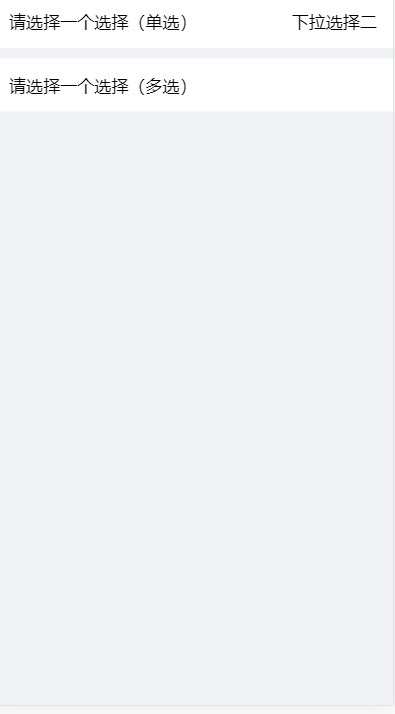
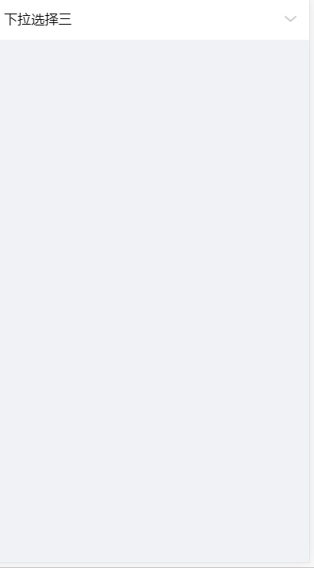

# ym-Selection

## Introduction

actionSheet 和 dropDown 是由用户操作后触发的一种选择弹出框 ，呈现一组与当前情境相关的一个或多个选项。

## 1、actionSheet



### Usage
```
import vActionSheet from '../../components/actionSheet'
```

```html
<v-actionSheet
  text="这里是辅助提示文本"
  v-if="showSelectMulti"
  :list="list"
  :multiple="multiple"
  :default-props="defaultProps"
  :select-list="selectList"
  @submitSelect="submitSelect"
  @cancelSelect="cancelSelect">
</v-actionSheet>
```

### Props

| name         | type    | default | description    |
| ------------ | ------- | ------- | -------------- |
| title        | String  | 请选择  | 标题           |
| subTitle     | String  | 副标题  | 副标题         |
| list         | Array   | []      | 选择的数组     |
| multiple     | Boolean | false   | 是否多选       |
| selectItem   | Object  | {}      | 已选择项(单选) |
| selectList   | Array   | []      | 已选择项(多选) |
| defaultProps | Object  | /       | 关联标识       |

### Events

| name         | params                 | description  |
| ------------ | ---------------------- | ------------ |
| submitSelect | selectItem/ selectList | 选择后的回调 |
| cancelSelect | /                      | 取消选择     |

## 2、dropDown


### Usage

```
import vDropDown from '../../components/dropdown'
```

```html
<v-dropDown
  :list="list"
  :default-props="defaultProps"
  :select-item="selectItem"
  @selectChange="selectChange">
</v-dropDown>
```

### Props

| name         | type   | default | description |
| ------------ | ------ | ------- | ----------- |
| list         | Array  | []      | 选择的数组  |
| selectItem   | Object | {}      | 已选择项    |
| defaultProps | Object | /       | 关联标识    |

### Events

| name         | params     | description  |
| ------------ | ---------- | ------------ |
| selectChange | selectItem | 选择后的回调 |
